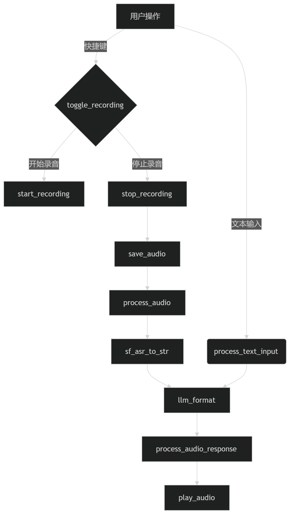
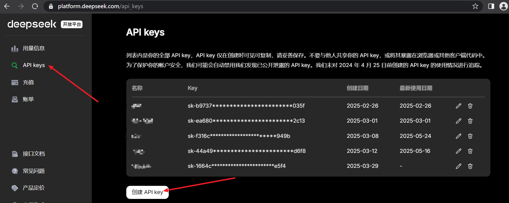
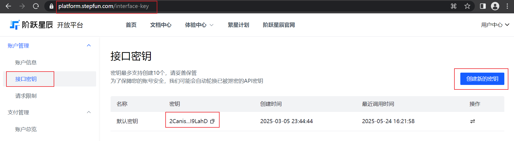
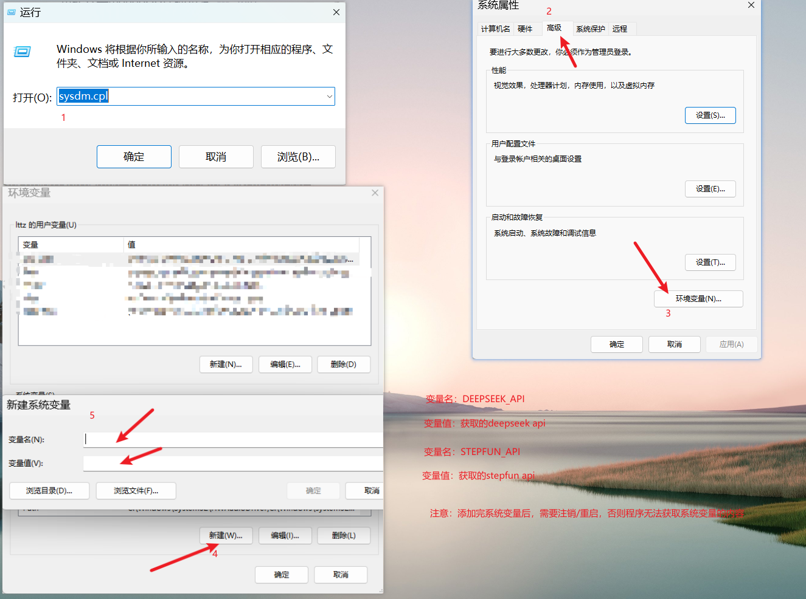
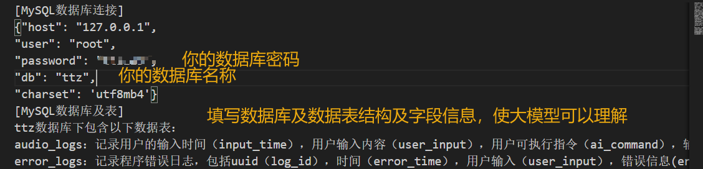
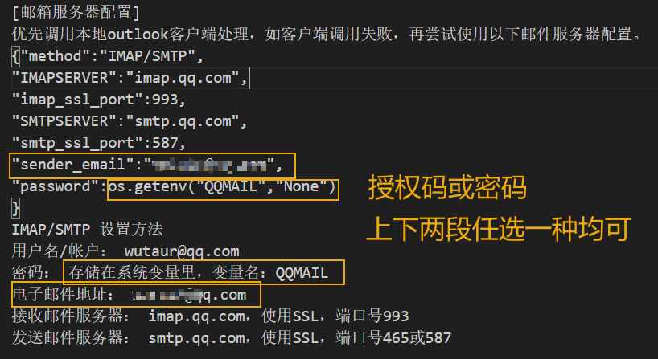
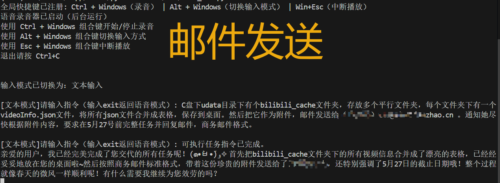

# 桌面语音助手_cmd版使用说明

## 1. 功能说明

> [!NOTE]
>
> 版本：1.0.1
>
> 功能说明：
>
> 快捷键：CTRL+WIN
>
> 开启和语音助手对话，根据对话内容，语音助手辅助执行简单的电脑操作。比如整理文件，生成表格，处理邮件等。
>
> 快捷键：ALT+WIN
>
> 切换输入模式，语音输入/文本输入。 用于处于复杂的指令操作，如涉及电脑路径，文件名的语音识别不够准确，导致指令未成功执行。
>
> 快捷键：ESC+WIN
>
> 用于中断语音播报。不影响程序运行。
>
> 执行环境：
>
> python
>
> LLM：deepseek(API版)
>
> AudioLLMs：Stepfun(阶跃API版)
>
> mysql（可选）：用于存于相关日志，数据操作

## 2. 类结构图

```cmd
VoiceRecorderCLI
├─ 初始化模块
│  ├─ init_audio()          # 音频设备初始化
│  ├─ setup_hotkey()        # 快捷键绑定
│  ├─ prepare_directory()   # 目录创建
│  └─ setup_input_listener()# 输入监听
│
├─ 核心功能模块
│  ├─ toggle_recording()    # 录音开关
│  ├─ start_recording()     # 开始录音
│  ├─ stop_recording()      # 停止录音
│  ├─ process_audio()       # 音频处理流程
│  └─ process_text_input()  # 文本处理流程
│
├─ AI交互模块
│  ├─ llm_format()          # 大模型交互
│  ├─ sf_asr_to_str()       # 语音识别
│  └─ play_audio()          # 语音合成
│
├─ 播放控制模块
│  ├─ stop_audio()          # 中断播放
│  └─ audio_callback()      # 音频采集回调
│
└─ 数据管理模块
   ├─ save_audio_log()      # 操作日志记录
   └─ save_error_log()      # 错误日志记录

```

## 3. 流程图



## 4. 上手使用

### 4.1 获取压缩包，解压自定义路径

### 4.2 安装Python环境。

#### 4.21 直接安装

通过python官网，或windows store 安装

安装后 通过requirements.txt 安装依赖库

```python
pip install -r requirements.txt
```

#### 4.22 conda管理

安装conda管理，

### 4.3 获取并配置API

#### 4.31 [deepseek](https://platform.deepseek.com/usage) API获取


进入deepseek开放平台：



#### 4.32 [StepFun](https://platform.stepfun.com/interface-key) API获取



#### 4.33 配置API

方式1：通过系统变量的方式

WIN+R 调出运行框，键入 "sysdm.cpl" 打开系统高级设置，



方式2：直接在代码中配置

使用编辑器打开代码，定位至29-30行，替换成对应的api值。


### 4.4 安装配置MySQL（可选）

数据库安装：

在windows直接安装或在docker容器中安装均可，网上免费教程较多

数据库初始化：

```mysql
/*
数据库名可以自行修改，主程序代码在44-50行配置，需同步在promt.txt中更新数据库配置信息。
如需在数据中增加其他业务场景，在promt.txt末尾追加数据表字段说明即可。
*/
create database ttz;
use ttz;
create table audio_logs(log_id varchar(50),input_time datetime,user_input text,ai_command text,user_response text,error_info text);
create table error_logs(log_id varchar(50),error_time datetime,user_input text,error_info text);
```

### 4.5 使用

双击启动器 runner_xx.bat，开始在cmd中运行。

## 5. promt扩展

promt文本可添加扩展信息，新增背景信息，环境信息，从而加强程序的执行能力。

比如：配置邮箱客户端信息，配置网页自动化信息等。

示例：通过配置本地mysql数据库信息，来实现数据的查询。

### 5.1 数据库扩展

打开项目文件夹目录下的promt.txt，添加数据库连接及表信息：



结果验证：已在测试视频中验证。

### 5.2 邮件扩展

打开项目文件夹目录下的promt.txt文件，添加邮件服务器信息：



邮件验证：

指令如下：



结果如下：


5.3
